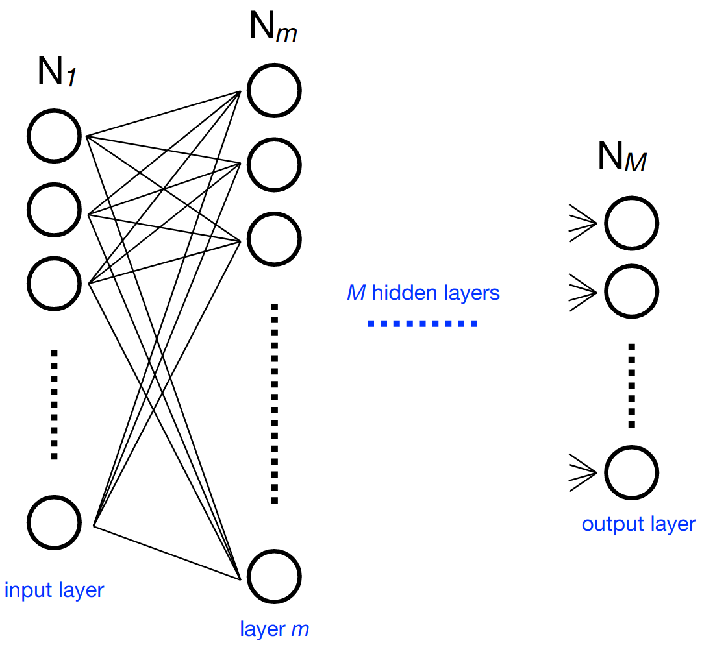
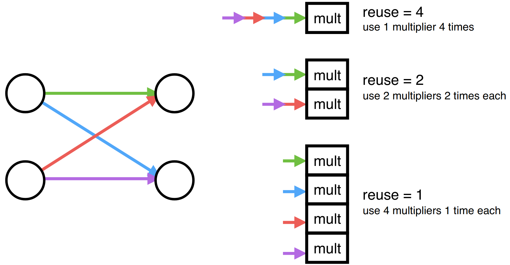

# Concepts

The goal of hls4ml is to provide an efficient and fast translation of machine learning models from open-source packages (like Keras and PyTorch) for training machine learning algorithms to high level synthesis (HLS) code that can then be transpiled to run on an FPGA. The resulting HLS project can be then used to produce an IP which can be plugged into more complex designs or be used to create a kernel for CPU co-processing. The user has freedom to define many of the parameters of their algorithm to best suit their needs.  

The hls4ml package enables fast prototyping of a machine learning algorithm implementation in FPGAs,
greatly reducing the time to results and giving the user intuition for how to best design a machine learning algorithm for their application while balancing performance, resource utilization and latency requirements.

## The Inspiration

The inspiration for the creation of the hls4ml package stems from the high energy physics community at the Large Hadron Collider (LHC). While machine learning has already been proven to be extremely useful in analysis of data from detectors at the LHC, it is typically performed in an "offline" environment after the data is taken and agglomerated. However, one of the largest problems at detectors on the LHC is that collisions, or "events", generate too much data for everything to be saved. As such, filters called "triggers" are used to determine whether a given event should be kept. Using FPGAs allows for significantly lower latency so machine learning algorithms can essentially be run "live" at the detector level for event selection. As a result, more events with potential signs of new physics can be preserved for analysis.

## The Solution: hls4ml

 

  

With this in mind, let's take a look at how hls4ml helps to achieve such a goal. First, it's important to realize the architecture differences between an FPGA and a CPU or GPU. An FPGA can be specifically programmed to do a certain task, in this case evaluate neural networks given a set of inputs, and as such can be highly optimized for the task, with tricks like pipelining and parallel evaluation. However, this means dynamic remapping while running isn't really a possibility. FPGAs also often come at a comparatively low power cost with respect to CPUs and GPUs. This allows hls4ml to build HLS code from compressed neural networks that results in predictions on the microsecond scale for latency. The hls4ml tool saves the time investment needed to convert a neural network to a hardware design language or even HLS code, thus allowing for rapid prototyping.

## How it Works

 

  

Consider a multi-layered neural network. At each neuron in a layer  _m_  (containing  _N__m_  neurons), we calculate an output value (part of the output vector  _**x**_m  of said layer) using the sum of output values of the previous layer multiplied by independent weights for each of these values and a bias value. An activation function is performed on the result to get the final output value for the neuron. Representing the weights as a  _N__m_ by _N__m-1_  matrix  _W__m,m-1_ , the bias values as  _**b**_m, and the activation function as  _g__m_, we can express this compactly as:

 
 <b><i>x</i></b><i>m</i> = <i>g</i><i>m</i>(<i>W</i><i>m,m-1</i> <b><i>x</i></b><i>m-1</i> + <b><i>b</i></b><i>m</i>) 

With hls4ml, each layer of output values is calculated independently in sequence, using pipelining to speed up the process by accepting new inputs after an initiation interval. The activations, if nontrivial, are precomputed. 

To ensure optimal performance, the user can control aspects of their model, principally:

   * **Size/Compression** - Though not explicitly part of the hls4ml package, this is an important optimization to efficiently use the FPGA resources
   * **Precision** - Define the <a href="PROFILING.html"> precision </a> of the calculations in your model
   * **Dataflow/Resource Reuse** - Control parallel or serial model implementations with varying levels of pipelining
   * **Quantization Aware Training** - Achieve best performance at low precision with tools like QKeras, and benefit automatically during inference with hls4ml parsing of QKeras models

 

 

Often, these decisions will be hardware dependent to maximize performance. Of note is that simplifying the input network must be done before using hls4ml to generate HLS code, for optimal compression to provide a sizable speedup. Also important to note is the use of fixed point arithmetic in hls4ml. This improves processing speed relative to floating point implementations. The hls4ml package also offers the functionality of configuring binning and output bit width of the precomputed activation functions as necessary. With respect to parallelization and resource reuse, hls4ml offers a "reuse factor" parameter that determines the number of times each multiplier is used in order to compute a layer of neuron's values. Therefore, a reuse factor of one would split the computation so each multiplier had to only perform one multiplication in the computation of the output values of a layer, as shown above. Conversely, a reuse factor of four, in this case, uses a single multiplier four times sequentially. Low reuse factor achieves the lowest latency and highest throughput but uses the most resources, while high reuse factor save resources at the expense of longer latency and lower throughput. The reuse factor can be set using the <a href="setup/CONFIGURATION.html">configuration options</a>.

Thereby, the hls4ml package builds efficient HLS code to implement neural networks on FPGAs for microsecond-scale latency on predictions. For more detailed information, take a look at our <a href="REFERENCE.html">references</a> page. All figures on this page are taken from the following paper: [JINST 13 P07027 (2018)](https://dx.doi.org/10.1088/1748-0221/13/07/P07027).

