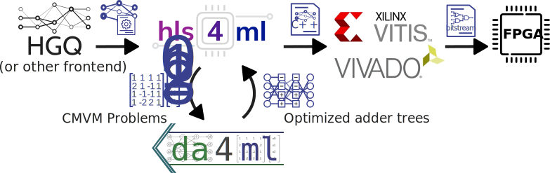

======================
Distributed Arithmetic
======================

.. image:: https://img.shields.io/badge/License-LGPLv3-blue.svg
   :target: https://www.gnu.org/licenses/lgpl-3.0.en.html
.. image:: https://badge.fury.io/py/da4ml.svg
   :target: https://badge.fury.io/py/da4ml
.. image:: https://img.shields.io/badge/arXiv-2507.04535-b31b1b.svg
   :target: https://arxiv.org/abs/2507.04535

Distributed Arithmetic (DA) is a strategy for constant-matrix-vector multiplication (CMVM) operations used in hls4ml. The implementation is provided by an external library, `da4ml <https://github.com/calad0i/da4ml>`__, which can be installed with ``pip install hls4ml[da]``. The library transforms the CMVM operations into an adder graph with common subexpression elimations to reduce the overall complexity. As the CMVM operation is fully unrolled, `reuse_factor` **must** be 1 (by default) for the corresponding CMVM operations [*]_. Comparing to the traditional `Latency` strategy CMVM kernels, DA can usually reduce up to 30% of the LUTs and all DSPs used.

.. rst-class:: light

When the DA strategy is used, the CMVM operations will be implemented bit-exactly, and the accumulator precision setting will not be used.

.. [*] Not to be confused with `II=1`. `reuse_factor` is the `II` for one CMVM operation, not one layer. One layer may invoke the same CMVM kernel multiple times and thus has `II>1` while each CMVM operation is unrolled, e.g., convolution layers with more than one partition.

Currently, the DA strategy is only available for the Vivado/Vitis HLS backends. The following layers are supported:
* Dense
* Convolutional (1D, 2D)
* EinsumDense
* Multi-head attention (implemented as multiple EinsumDense layers)

While possible, the RNN layers are not yet supported by the DA strategy.

For more details, please refer to the `da4ml repository <https://github.com/calad0i/da4ml>`__ or the `paper <https://arxiv.org/abs/2507.04535>`__.
