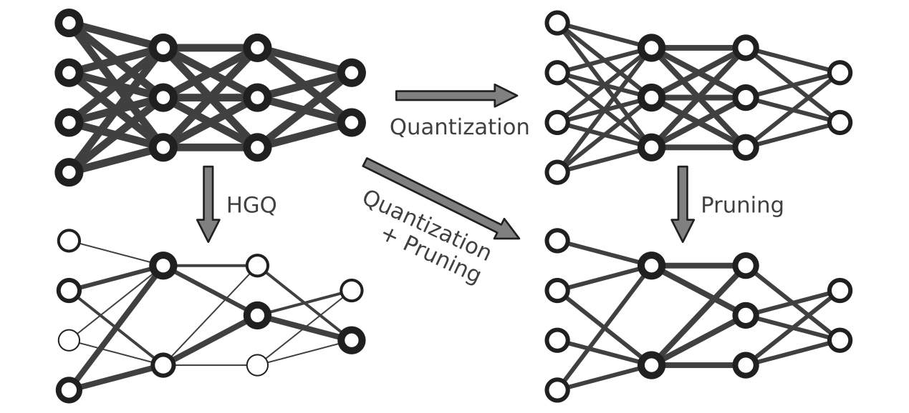

======================================
High Granularity Quantization (HGQ2)
======================================

.. note::
   New projects are encouraged to use ``HGQ2`` instead of the original ``HGQ`` (doc page moved `here <./hgq1   .html>`_).
   HGQ2 is a major improvement over HGQ with more supported layers, more quantizer options, better performance. As HGQ2 moves to Keras v3, it can be used natively with ``JAX``, ``PyTorch``, and ``TensorFlow`` backends.

.. image:: https://img.shields.io/badge/License-LGPLv3-blue.svg
   :target: https://www.gnu.org/licenses/lgpl-3.0.en.html
.. image:: https://github.com/calad0i/HGQ2/actions/workflows/sphinx-build.yml/badge.svg
   :target: https://calad0i.github.io/HGQ2/
.. image:: https://badge.fury.io/py/hgq2.svg
   :target: https://badge.fury.io/py/hgq2
.. image:: https://img.shields.io/badge/arXiv-2405.00645-b31b1b.svg
   :target: https://arxiv.org/abs/2405.00645

HGQ2 (High Granularity Quantization 2) is a quantization-aware training framework built on Keras v3, targeting real-time deep learning applications on edge devices like FPGAs. It provides a comprehensive set of tools for creating and training quantized neural networks with minimal effort.

HGQ2 implements an gradient-based automatic bitwidth optimization and quantization-aware training algorithm. By laveraging gradients, it allows for bitwidth optimization at arbitrary granularity, up to per-weight and per-activation level.

.. rst-class:: light

Key Features
------------

- **Multi-backend support**: Works with TensorFlow, JAX, and PyTorch through Keras v3
- **Flexible quantization**: Supports different quantization schemes including fixed-point and minifloat
- **Hardware synthesis**: Direct integration with hls4ml for FPGA deployment
- **Trainable quantization parameters**: Optimize bitwidths through gradient-based methods
- **Effective Bit-Operations (EBOP)**: Accurate resource estimation during training for the deployed firmware
- **Advanced layer support**: HGQ2 supports advanced layers like einsum, einsum dense, and multi-head attention layers with quantization and hardware synthesis support

.. code-block:: python
   :caption: Simple example

   import keras
   from hgq.layers import QDense, QConv2D
   from hgq.config import LayerConfigScope, QuantizerConfigScope

   # Setup quantization configuration
   # These values are the defaults, just for demonstration purposes here
   with (
      # Configuration scope for setting the default quantization type and overflow mode
      # The second configuration scope overrides the first one for the 'datalane' place
      QuantizerConfigScope(place='all', default_q_type='kbi', overflow_mode='SAT_SYM'),
      # Configuration scope for enabling EBOPs and setting the beta0 value
      QuantizerConfigScope(place='datalane', default_q_type='kif', overflow_mode='WRAP'),
      LayerConfigScope(enable_ebops=True, beta0=1e-5),
   ):
      model = keras.Sequential([
         QConv2D(32, (3, 3), activation='relu'),
         keras.layers.MaxPooling2D((2, 2)),
         keras.layers.Flatten(),
         QDense(10)
      ])

   ... # Training, evaluation, and anything else you want to do with the model

   model_hls = hls4ml.converters.convert_from_keras(model, ...)
   # Model-wise precision propagation is done automatically for HGQ models for bit-exactness
   # Do NOT pass precision config if you don't know what you are doing

   model_hls.compile()

.. note::
   Do not pass any precision configuration from ``hls4ml.converters.convert_from_keras`` in general. HGQ-defined models will invoke model-wise precision propagation automatically to ensure bit-exactness between the Keras model and the generated HLS code (See `here <./precision.html>`__ for more details).
