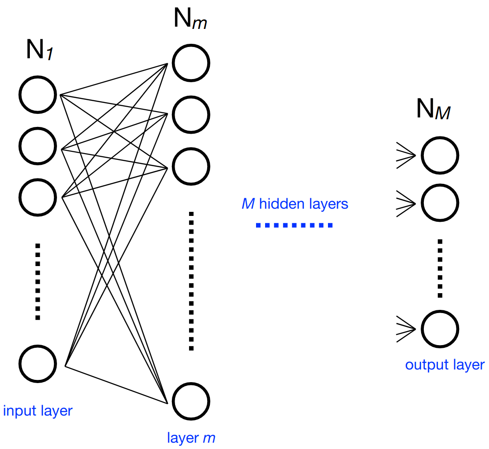
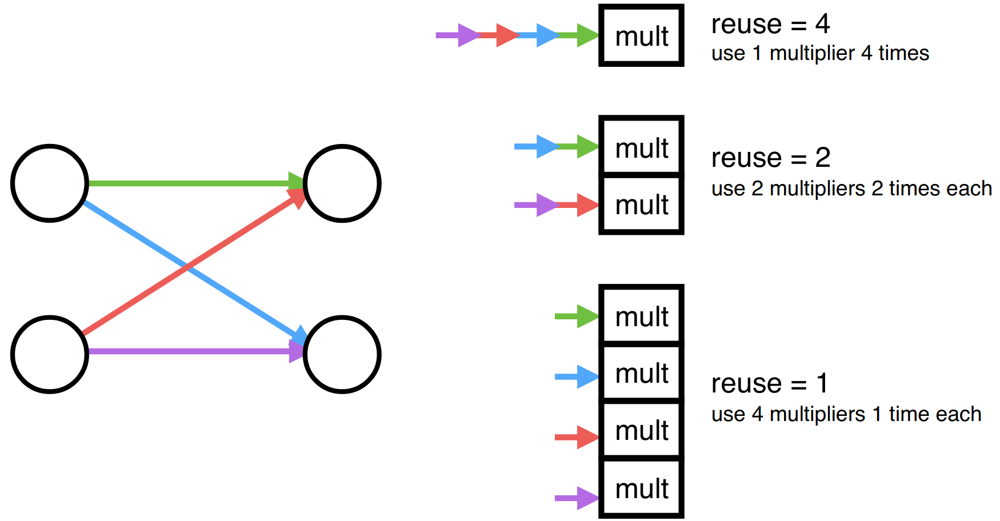

========
Concepts
========

How it Works
----------------------

Consider a multilayer neural network. At each neuron in a layer :math:`m`  (containing :math:`N_m` neurons), we calculate an output value (part of the output vector :math:`\mathbf{x}_m` of said layer) using the sum of output values of the previous layer multiplied by independent weights for each of these values and a bias value. An activation function is performed on the result to get the final output value for the neuron. Representing the weights as a :math:`N_m` by :math:`N_{m-1}`  matrix  :math:`W_{m,m-1}`, the bias values as :math:`\mathbf{b}_m`, and the activation function as :math:`g_m`, we can express this compactly as:

.. math::

   \mathbf{x}_m = g_m (W_{m,m-1} \mathbf{x}_{m-1} +\mathbf{b}_m)

With hls4ml, each layer of output values is calculated independently in sequence, using pipelining to speed up the process by accepting new inputs after an initiation interval.
The activations, if nontrivial, are precomputed.

To ensure optimal performance, the user can control aspects of their model, principally:

* **Size/Compression** - Though not explicitly part of the ``hls4ml`` package, this is an important optimization to efficiently use the FPGA resources
* **Precision** - Define the :doc:`precision <../advanced/profiling>` of the calculations in your model
* **Dataflow/Resource Reuse** - Control parallel or streaming model implementations with varying levels of pipelining
* **Quantization Aware Training** - Achieve best performance at low precision with tools like QKeras, and benefit automatically during inference with ``hls4ml`` parsing of QKeras models

Often, these decisions will be hardware dependent to maximize performance.
Of note is that simplifying the input network must be done before using ``hls4ml`` to generate HLS code, for optimal compression to provide a sizable speedup.
Also important to note is the use of fixed point arithmetic in ``hls4ml``.
This improves processing speed relative to floating point implementations.
The ``hls4ml`` package also offers the functionality of configuring binning and output bit width of the precomputed activation functions as necessary. With respect to parallelization and resource reuse, ``hls4ml`` offers a "reuse factor" parameter that determines the number of times each multiplier is used in order to compute a layer of neuron's values. Therefore, a reuse factor of one would split the computation so each multiplier had to only perform one multiplication in the computation of the output values of a layer, as shown above. Conversely, a reuse factor of four, in this case, uses a single multiplier four times sequentially. Low reuse factor achieves the lowest latency and highest throughput but uses the most resources, while high reuse factor save resources at the expense of longer latency and lower throughput.

Frontends and Backends
----------------------

``hls4ml`` has a concept of a **frontend** that parses the input NN into an internal model graph, and a **backend** that controls
what type of output is produced from the graph. Frontends and backends can be independently chosen. Examples of frontends are the
parsers for Keras or ONNX, and examples of backends are Vivado HLS, Intel HLS, and Vitis HLS. See :ref:`Status and Features` for the
currently supported frontends and backends or the dedicated sections for each frontend/backend.

I/O Types
---------

``hls4ml`` supports multiple styles for handling data transfer to/from the network and between layers, known as the ``io_type``.

io_parallel
^^^^^^^^^^^
In this processing style, data is passed in parallel between the layers. Conceptually this corresponds to the C/C++ array where all elements can be accessed ay any time. This style allows for maximum parallelism and is well suited for MLP networks and small CNNs which aim for lowest latency. Due to the impact of parallel processing on resource utilization on FPGAs, the synthesis may fail for larger networks.

io_stream
^^^^^^^^^
As opposed to the parallel processing style, in ``io_stream`` mode data is passed one "pixel" at a time. Each pixel is an array of channels, which are always sent in parallel. This method for sending data between layers is recommended for larger CNN and RNN networks. For one-dimensional ``Dense`` layers, all the inputs are streamed in parallel as a single array.

With the ``io_stream`` IO type, each layer is connected with the subsequent layer through first-in first-out (FIFO) buffers.
The implementation of the FIFO buffers contribute to the overall resource utilization of the design, impacting in particular the BRAM or LUT utilization.
Because the neural networks can have complex architectures generally, it is hard to know a priori the correct depth of each FIFO buffer.
By default ``hls4ml`` choses the most conservative possible depth for each FIFO buffer, which can result in a an unnecessary overutilization of resources.

In order to reduce the impact on the resources used for FIFO buffer implementation, we have a FIFO depth optimization flow. This is described
in the :ref:`FIFO Buffer Depth Optimization` section.

Strategy
---------

**Strategy** in ``hls4ml`` refers to the implementation of core matrix-vector multiplication routine, which can be latency-oriented, resource-saving oriented, or specialized. Different strategies will have an impact on overall latency and resource consumption of each layer and users are advised to choose based on their design goals. The availability of particular strategy for a layer varies across backends, see the :doc:`Attributes <../ir/attributes>` section for a complete list of available strategies per-layer and per-backend.
