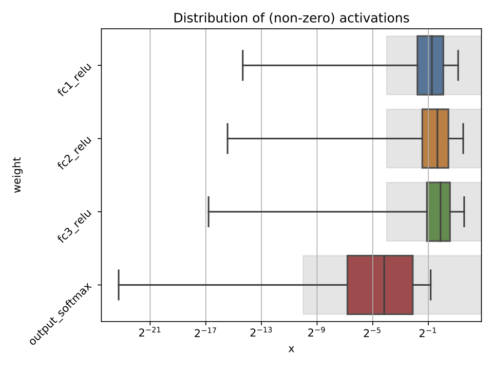
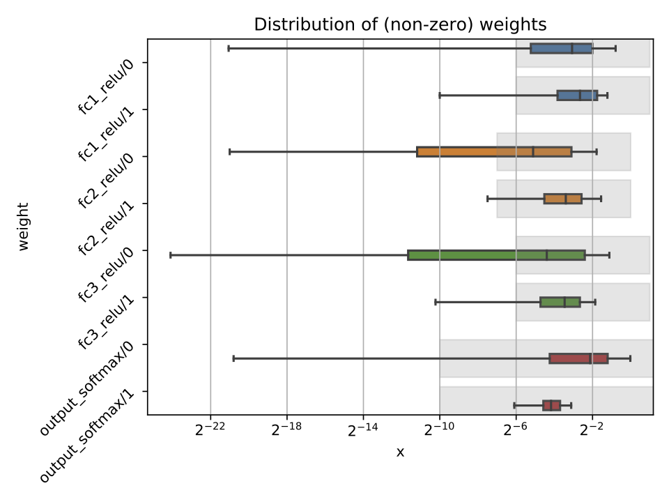

=========
Profiling
=========

In the ``hls4ml`` configuration file, it is possible to specify the model ``Precision`` and ``ReuseFactor`` with fine granularity.

Using a low precision can help reduce the FPGA resource usage of a model, but may result in loss of model performance if chosen inappropriately. The profiling tools in ``hls4ml`` help you to decide the appropriate model precision.

Profiling uses some extra dependencies, to install these, run ``pip install hls4ml[profiling]``. The profiling tools are provided as a ``Python`` module which you can use.

Three types of objects can be provided: **a Keras model object**\ , **test data**\ , and an **ModelGraph object**.
You will need to initialise these objects by using a trained model, loading a model from a file, and loading your data. The Keras model and data each need to be in the format that would normally allow you to run, e.g. ``model.predict(X)``.

.. code-block:: python

   from hls4ml.model.profiling import numerical
   from hls4ml.converters import keras_to_hls
   import matplotlib.pyplot as plt
   import yaml

   # pseudo code:
   model = load_model()
   X = load_data()

   # real code:
   # load your hls4ml .yml config file with yaml
   with open("keras-config.yml", 'r') as ymlfile:
       config = yaml.load(ymlfile)

   hls_model = keras_to_hls(config)

   # produce an activation profile (ap)
   # and weights profile (wp)
   ap, wp = numerical(keras_model=model, hls_model = hls_model, X=X)
   plt.show()

Calling the ``hls4ml.model.profiling.numerical`` method with these three objects provided will produce two figures as below:

Different plots styles are available with the ``plot`` keyword argument. Valid options are ``boxplot`` (default), ``histogram``\ , ``violinplot``. In the default boxplot style, each variable in the neural network is evaluated using the given test data and the distribution of (non-zero) values is shown with a box and whisker diagram.

When different combinations of the input objects are given, different plots will be produced:

1) Only Keras model: only the weights profile plot will be produced, the activation profile will be ``None``. No grey boxes representing the data types will be shown.

2) Only ModelGraph (or ModelGraph and Keras model): only the weights profile plot will be produced, with grey boxes indicating the data types from the ModelGraph. 

3) Keras model and data (\ ``X``\ ): both the weights profile and activation profile will be produced. No grey boxes representing the data types will be shown.

4) Keras model, ModelGraph, and data: both weights and activation profiles are produced, with grey boxes indicating the data types from the ModelGraph.

Each box shows the median and quartiles of the distribution. The grey shaded boxes show the range which can be represented with the ``hls4ml`` config file used.

As a starting point, a good configuration would at least cover the box and whisker for each variable with the grey box. Make sure the box and whisker is contained to the right by using sufficient integer bits to avoid overflow. It might be that more precision is needed (grey boxes extend further to the left) to achieve satisfactory performance. In some cases, it is safe to barely cover the values and still achieve good accuracy.

To establish whether the configuration gives good performance, run C Simulation with test data and compare the results to your model evaluated on the CPU with floating point.
