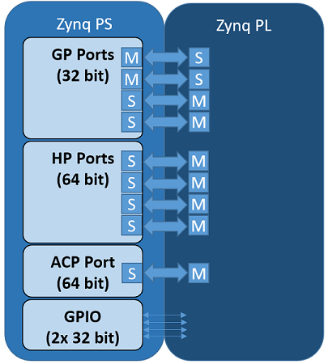
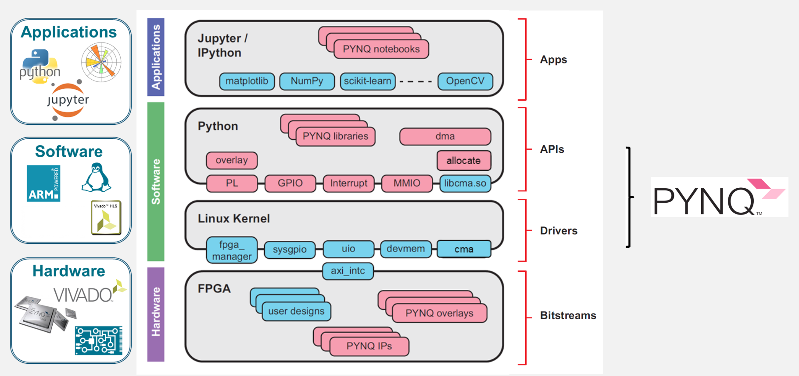

=================
VivadoAccelerator
=================

The **VivadoAccelerator** backend of ``hls4ml`` leverages the `PYNQ <http://pynq.io/>`_ software stack to easily deploy models on supported devices.
Currently ``hls4ml`` supports the following boards:

* `pynq-z2 <https://www.xilinx.com/support/university/xup-boards/XUPPYNQ-Z2.html>`_ (part: ``xc7z020clg400-1``)
* `zcu102 <https://www.xilinx.com/products/boards-and-kits/ek-u1-zcu102-g.html>`_ (part: ``xczu9eg-ffvb1156-2-e``)
* `alveo-u50 <https://www.xilinx.com/products/boards-and-kits/alveo/u50.html>`_ (part: ``xcu50-fsvh2104-2-e``)
* `alveo-u250 <https://www.xilinx.com/products/boards-and-kits/alveo/u250.html>`_ (part: ``xcu250-figd2104-2L-e``)
* `alveo-u200 <https://www.xilinx.com/products/boards-and-kits/alveo/u200.html>`_ (part: ``xcu200-fsgd2104-2-e``)
* `alveo-u280 <https://www.xilinx.com/products/boards-and-kits/alveo/u280.html>`_ (part: ``xcu280-fsvh2892-2L-e``)

but, in principle, support can be extended to `any board supported by PYNQ <http://www.pynq.io/board.html>`_.
For the Zynq-based boards, there are two components: an ARM-based processing system (PS) and FPGA-based programmable logic (PL), with various interfaces between the two.

Neural Network Overlay
======================

In the PYNQ project, programmable logic circuits are presented as hardware libraries called *overlays*.
The overlay can be accessed through a Python API.
In ``hls4ml``, we create a custom **neural network overlay**, which sends and receives data via AXI stream.
The target device is programmed using a bitfile that is generated by the ``VivadoAccelerator`` backend.

Example
=======

This example is taken from `part 7 of the hls4ml tutorial <https://github.com/fastmachinelearning/hls4ml-tutorial/blob/master/part7_deployment.ipynb>`_.
Specifically, we'll deploy a model on a ``pynq-z2`` board.

First, we generate the bitfile from a Keras model ``model`` and a config.

.. code-block:: Python

    import hls4ml
    config = hls4ml.utils.config_from_keras_model(model, granularity='name')
    hls_model = hls4ml.converters.convert_from_keras_model(model,
                                                           hls_config=config,
                                                           output_dir='hls4ml_prj_pynq',
                                                           backend='VivadoAccelerator',
                                                           board='pynq-z2')
    hls4ml.build(bitfile=True)

After this command completes, we will need to package up the bitfile, hardware handoff, and Python driver to copy to the PS of the board.

.. code-block:: bash

    mkdir -p package
    cp hls4ml_prj_pynq/myproject_vivado_accelerator/project_1.runs/impl_1/design_1_wrapper.bit package/hls4ml_nn.bit
    cp hls4ml_prj_pynq/myproject_vivado_accelerator/project_1.srcs/sources_1/bd/design_1/hw_handoff/design_1.hwh package/hls4ml_nn.hwh
    cp hls4ml_prj_pynq/axi_stream_driver.py package/
    tar -czvf package.tar.gz -C package/ .

Then we can copy this package to the PS of the board and untar it.

Finally, on the PS in Python we can create a ``NeuralNetworkOverlay`` object, which will download the bitfile onto the PL of the board.
We also must provide the shapes of our input and output data, ``X_test.shape`` and ``y_test.shape``, respectively, to allocate the buffers for the data transfer.
The ``predict`` method will send the input data to the PL and return the output data ``y_hw``.

.. code-block:: Python

    from axi_stream_driver import NeuralNetworkOverlay

    nn = NeuralNetworkOverlay('hls4ml_nn.bit', X_test.shape, y_test.shape)
    y_hw, latency, throughput = nn.predict(X_test, profile=True)
