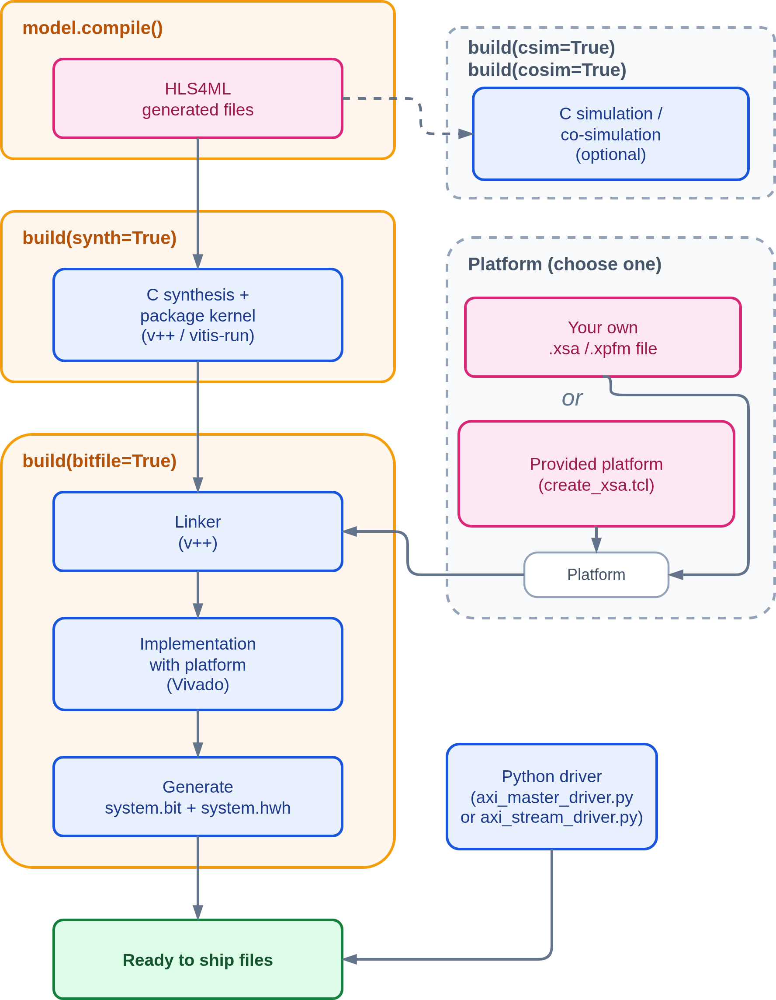

============
VitisUnified
============

The **VitisUnified** backend provides an end-to-end workflow for AMD SoC boards, from an ML model to a design that is ready to deploy on `PYNQ <http://pynq.io/>`_. It is inherited from the :doc:`Vitis <vitis>` backend. We use the new Vitis Unified software, which can automatically link the HLS kernel to the system hardware. The current version supports only SoC boards with a PYNQ Python driver.

It is the recommended flow for AMD SoC boards with Vitis 2023.2 or newer. Models with ``io_parallel`` or with ``ap_fixed`` interface types stay with the :doc:`VivadoAccelerator <accelerator>` backend.

Currently ``hls4ml`` officially supports the following boards and tool versions:

* `zcu102 <https://www.xilinx.com/products/boards-and-kits/ek-u1-zcu102-g.html>`_ (Vitis and Vivado 2023.2)
* `kv260 <https://www.xilinx.com/products/som/kria/kv260-vision-starter-kit.html>`_ (Vitis and Vivado 2023.2 and 2025.2)

If you use another board, another Vivado version, or want to optimize the system design for your own workload, you can build your own platform. The steps are covered in the platform setup tutorial in the accelerator backend section of the `hls4ml-tutorial <https://github.com/fastmachinelearning/hls4ml-tutorial>`_ repository.

System Flow
===========

The figure below shows the flow of the backend, from the generated HLS files to the files that are ready to ship to the board.

.. _vitis_unified_axi_modes:

AXI interface modes
===================

The backend supports two ways to move data between the PS and the kernel, selected with ``axi_mode``.
In both modes the CPU controls the kernel through AXI-Lite and receives an interrupt when the kernel is done.

``axi_master`` (default)
    The kernel reads its input and writes its output in DDR by itself through an AXI master port.
    The driver allocates one DDR buffer per model input and output, so models with several inputs or outputs are supported.

    .. image:: ../img/vitis_unified_axi_master.png
      :width: 450px
      :align: center
      :alt: axi_master mode

``axi_stream``
    The kernel has one AXI-Stream input and one AXI-Stream output. An AXI DMA in the platform moves the data between DDR and the kernel.
    Only models with one input and one output are supported.

    .. image:: ../img/vitis_unified_axi_stream.png
      :width: 450px
      :align: center
      :alt: axi_stream mode

    The stream interface follows this contract:

    * Each beat carries one element. The data field uses the ``input_type`` format, 32 bits for ``float`` and 64 bits for ``double``.
    * For each kernel start the kernel reads exactly ``batch_size × N_IN`` input beats and writes exactly ``batch_size × N_OUT`` output beats. ``N_IN`` and ``N_OUT`` are the flattened input and output sizes of the model.
    * ``TLAST`` is set only on the last output beat of the batch. ``TLAST`` on the input is ignored, so a transfer with fewer beats than expected makes the kernel wait.

Configuration options
=====================

The options below are passed as keyword arguments to the converter (for example ``convert_from_keras_model``).
They are stored under ``VitisUnifiedConfig`` in the model configuration.

.. list-table::
   :header-rows: 1
   :widths: 30 18 52

   * - Option
     - Default
     - Description
   * - ``board``
     - ``zcu102``
     - | Target board.
       | It selects the FPGA part, the platform, and the Python driver template.
       | The current version only supports the boards in ``supported_boards.json`` (``zcu102`` and ``kv260``).
       | Any other board name is rejected with an error.
       | You can add your own board: build its platform and add it to the backend by following the platform setup tutorial in the `hls4ml-tutorial <https://github.com/fastmachinelearning/hls4ml-tutorial>`_ repository.
   * - ``part``
     - from board
     - | FPGA part name.
       | If not given, it is taken from the board entry in ``supported_boards.json``.
   * - ``clock_period``
     - ``5``
     - | Kernel clock period in ns.
       | The same clock is used when the kernel is linked to the platform.
   * - ``clock_uncertainty``
     - ``12.5%``
     - | Clock uncertainty passed to Vitis HLS.
   * - ``io_type``
     - ``io_stream``
     - | hls4ml I/O type of the model.
       | The current version only supports ``io_stream``.
   * - ``axi_mode``
     - ``axi_master``
     - | Interface between the PS and the kernel: ``axi_master`` or ``axi_stream``.
       | See :ref:`AXI interface modes <vitis_unified_axi_modes>`.
   * - ``driver``
     - ``python``
     - | Type of driver generated for the board.
       | The current version only supports ``python`` (PYNQ).
   * - ``input_type``
     - ``float``
     - | Data type of the model input on the AXI interface.
       | The current version only supports ``float`` and ``double``.
       | The PYNQ driver uses the matching NumPy type.
   * - ``output_type``
     - ``float``
     - | Data type of the model output on the AXI interface.
       | The current version only supports ``float`` and ``double``.
       | It must be the same as ``input_type``.
   * - ``in_stream_buf_size``
     - ``128``
     - | Depth of the FIFO between the wrapper input (AXI master read or AXI-Stream) and the HLS model.
       | Used in both AXI modes. The unit is one entry of the model stream type (one chunk of the input array), not one element.
   * - ``out_stream_buf_size``
     - ``128``
     - | Depth of the FIFO between the HLS model and the wrapper output (AXI master write or AXI-Stream).
       | Used in both AXI modes. The unit is one entry of the model stream type (one chunk of the output array), not one element.

Example:

.. code-block:: Python

    hls_model = hls4ml.converters.convert_from_keras_model(model,
                                                           hls_config=config,
                                                           output_dir='hls4ml_prj_unified',
                                                           backend='VitisUnified',
                                                           board='kv260',
                                                           axi_mode='axi_stream',
                                                           clock_period=10,
                                                           in_stream_buf_size=256,
                                                           out_stream_buf_size=256)

Output directory layout
-----------------------

.. code-block:: text

    <output_dir>/
    ├── firmware/                          HLS sources: model, AXI wrapper, weights
    ├── tb_data/                           testbench input and reference output
    ├── myproject_test.cpp                 C testbench
    ├── <project_name>_bridge.cpp          bridge used by hls_model.predict()
    ├── build_lib.sh                       builds the shared library for predict()
    ├── hls4ml_config.yml
    ├── hls_kernel_config_csim.cfg         Vitis HLS config for csynth, package, and csim
    ├── hls_kernel_config_cosim.cfg        Vitis HLS config for cosim
    ├── hls_kernel_config.cfg              copy of the config used by the last step
    ├── fifo_depths.json                   with FIFO depth optimization only
    ├── <step>_stdout.log, <step>_stderr.log   with log_to_stdout=False only
    ├── vitis_workspace/
    │   ├── <project_name>/
    │   │   ├── vitis-comp.json            Vitis Unified component
    │   │   └── vitis_unified_project/     hls/, logs/, reports/, <project_name>_axi_*.xo
    │   ├── system_link/
    │   │   ├── link_system.cfg, link_system.sh
    │   │   ├── <project_name>.xclbin      link output (bitfile=True)
    │   │   └── _x/                        Vivado project of the system link
    │   └── <board>/
    │       ├── tcl_scripts/               create_xsa.tcl, platform tcl, output/<board>_*.xsa
    │       └── python_drivers/            driver templates
    ├── export/
    │   ├── system.bit                     bitstream (bitfile=True)
    │   ├── system.hwh                     hardware handoff (bitfile=True)
    │   └── axi_master_driver.py or axi_stream_driver.py
    └── final_reports/                     timing, utilization, power, link summary, hls_compile.rpt

Build options
=============

``hls_model.build()`` runs the Vitis tools on the written project. Each step is selected with a keyword argument.

.. list-table::
   :header-rows: 1
   :widths: 26 74

   * - Argument
     - Effect
   * - ``synth=True``
     - Runs C synthesis with ``v++`` and then packages the kernel as a ``.xo`` file.
   * - ``csim=True``
     - Runs the C simulation of the AXI wrapper with the generated test bench.
   * - ``cosim=True``
     - Runs RTL co-simulation. It needs a synthesized project, so use it together with ``synth=True``.
   * - ``fifo_opt=True``
     - Runs the FIFO depth optimization. It turns on ``cosim`` by itself.
   * - ``vitis_fifo_sizing=True``
     - Uses the FIFO sizing feature of Vitis HLS during co-simulation. It turns on ``cosim`` by itself.
   * - ``bitfile=True``
     - Links the packaged kernel to the board platform and writes the bitstream and the hardware handoff file to ``export/``. It needs the ``.xo`` file from ``synth=True``.
   * - ``log_to_stdout=False``
     - Writes the output of each step to ``<step>_stdout.log`` and ``<step>_stderr.log`` instead of the terminal.
   * - ``reset``, ``vsynth``
     - Accepted for compatibility with the other backends, but not used in this version.

Differences from the other backends: ``validation`` and ``export`` are not available, ``synth`` always packages the kernel, and ``build()`` does not return a report in this version.
The reports are written under ``vitis_workspace/<project_name>/vitis_unified_project/reports/`` and ``final_reports/``.

Limitations
===========

The following are not supported in this version:

* ``io_parallel`` models. Only ``io_stream`` is supported.
* Fixed-point interface types. ``input_type`` and ``output_type`` must be ``float`` or ``double``, and they must be the same.
* Weights that become external BRAM ports through ``BramFactor``. The conversion stops with an error.
* Models with several inputs or outputs in ``axi_stream`` mode. Use ``axi_master`` for them.
* Multigraph models.
* A C or C++ host driver. Only the Python (PYNQ) driver is generated.
* Boards other than SoC boards with a PYNQ driver.

Tutorial
========

A step-by-step tutorial with notebooks is available in the accelerator backend section of the
`hls4ml-tutorial <https://github.com/fastmachinelearning/hls4ml-tutorial>`_ repository.
It covers prediction, C simulation, co-simulation, FIFO depth optimization, bitstream generation, and how to build your own platform.
