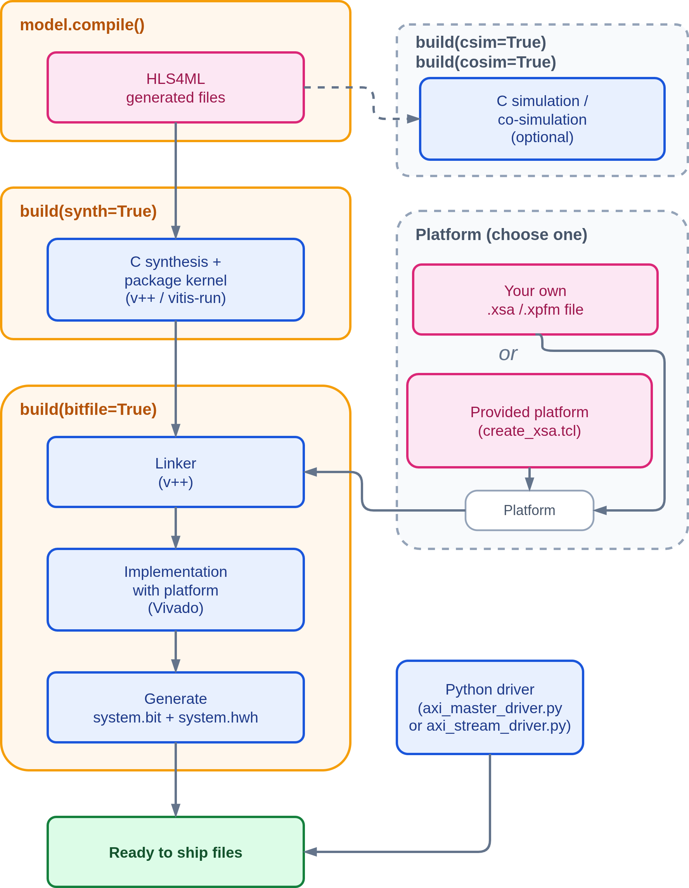

============
VitisUnified
============

The **VitisUnified** backend provides an end-to-end workflow for AMD SoC boards and data-center cards, from an ML model to a design that is ready to deploy. It is inherited from the :doc:`Vitis <vitis>` backend. We use the new Vitis Unified software, which can automatically link the HLS kernel to the system hardware. SoC boards are deployed with a `PYNQ <http://pynq.io/>`_ Python driver, data-center cards with an XRT one.

It is the recommended flow for AMD SoC boards with Vitis 2023.2 or newer. Models with ``io_parallel`` or with ``ap_fixed`` interface types stay with the :doc:`VivadoAccelerator <accelerator>` backend.

Currently ``hls4ml`` officially supports the following boards and tool versions:

* `zcu102 <https://www.xilinx.com/products/boards-and-kits/ek-u1-zcu102-g.html>`_ (Vitis and Vivado 2023.2)
* `kv260 <https://www.xilinx.com/products/som/kria/kv260-vision-starter-kit.html>`_ (Vitis and Vivado 2023.2 and 2025.2)
* `alveo-u55c <https://www.xilinx.com/products/boards-and-kits/alveo/u55c.html>`_ (Vitis and Vivado 2024.2 with the ``xilinx_u55c_gen3x16_xdma_3_202210_1`` platform, ``axi_master`` with ``driver='xrt'``)
* ``alveo-u50`` and ``alveo-u280`` (not tested on hardware, no ``kernel_slr``)

If you use another board, another Vivado version, or want to optimize the system design for your own workload, you can build your own platform. The steps are covered in the platform setup tutorial in the accelerator backend section of the `hls4ml-tutorial <https://github.com/fastmachinelearning/hls4ml-tutorial>`_ repository.

System Flow
===========

The figure below shows the flow of the backend, from the generated HLS files to the files that are ready to ship to the board.

.. _vitis_unified_axi_modes:

AXI interface modes
===================

The backend supports two ways to move data between the PS and the kernel, selected with ``axi_mode``.
In both modes the CPU controls the kernel through AXI-Lite and receives an interrupt when the kernel is done.

``axi_master`` (default)
    The kernel reads its input and writes its output in DDR by itself through an AXI master port.
    The driver allocates one DDR buffer per model input and output, so models with several inputs or outputs are supported.
    It takes the offsets of the pointer and batch-size registers from the hardware handoff file through PYNQ, so it does not depend on the register layout.

    .. image:: ../img/vitis_unified_axi_master.png
      :width: 450px
      :align: center
      :alt: axi_master mode

``axi_stream``
    The kernel has one AXI-Stream input and one AXI-Stream output. An AXI DMA in the platform moves the data between DDR and the kernel.
    Only models with one input and one output are supported.
    The driver expects the DMA instance to be called ``axi_dma_0``; another name can be passed with its ``dma_name`` argument.

    .. image:: ../img/vitis_unified_axi_stream.png
      :width: 450px
      :align: center
      :alt: axi_stream mode

    The stream interface follows this contract:

    * Each beat carries one element. The data field uses the ``input_type`` format, 32 bits for ``float`` and 64 bits for ``double``.
      The platforms built by the shipped Tcl scripts have a 32-bit DMA, so ``double`` is rejected with them and needs your own platform.
    * For each kernel start the kernel reads exactly ``batch_size × N_IN`` input beats and writes exactly ``batch_size × N_OUT`` output beats. ``N_IN`` and ``N_OUT`` are the flattened input and output sizes of the model.
    * ``TLAST`` is set only on the last output beat of the batch. ``TLAST`` on the input is ignored, so a transfer with fewer beats than expected makes the kernel wait.
    * ``TKEEP`` is driven all-ones on every output beat. It is required by the AXI DMA, which never completes a transfer without it. ``TKEEP`` on the input is not checked; every beat is taken as a full element.

.. _vitis_unified_cards:

Data-center cards
=================

A card is linked against an installed card platform instead of one built by Vivado, and it is driven by XRT over PCIe instead of by PYNQ. Two things follow from that, and both are handled by the ``board`` and ``driver`` options:

* The platform is looked up under ``PLATFORM_REPO_PATHS``, which has to be set when ``bitfile=True`` runs the link.
* The kernel pointers are assigned to memory banks explicitly. The banks of the board entry are split evenly over the pointer arguments, one contiguous slice each, and the generated driver allocates every buffer in the banks of its own kernel argument. For one input and one output on a card with 32 HBM banks that gives ``HBM[0:15]`` and ``HBM[16:31]``.
* The kernel is placed in the SLR given by ``kernel_slr`` in the board entry, so v++ pipelines the path to its memory banks.

Only ``axi_master`` is supported on a card. Instead of the raw bitstream and hardware handoff file that PYNQ needs, the ``.xclbin`` is copied to ``export/``.

The kernel runs on the card's scalable clock. Vitis implements it against the platform's default kernel frequency, 300 MHz on the U55C, and when routing misses that it lowers the clock in the ``.xclbin`` to the highest frequency that meets timing. The ``[clock]`` entry of ``link_system.cfg`` does not change this. ``clock_period`` still sets the HLS schedule, and since the HLS estimate leaves out routing, a short period pays off. A 16-64-32-32-5 jet tagger at ``ReuseFactor`` 1 ships at 112 MHz with ``clock_period=6.66`` and at 237 MHz with ``clock_period=3.333``. Adding ``in_stream_buf_size=2`` and the options below to ``link_system.cfg`` after ``write()`` gives 256 MHz:

.. code-block:: ini

    [vivado]
    prop=run.impl_1.STEPS.PHYS_OPT_DESIGN.ARGS.DIRECTIVE=AggressiveFanoutOpt
    prop=run.impl_1.STEPS.POST_ROUTE_PHYS_OPT_DESIGN.IS_ENABLED=true
    prop=run.impl_1.STEPS.POST_ROUTE_PHYS_OPT_DESIGN.ARGS.DIRECTIVE=AggressiveExplore

With Vivado 2024.2, ``run.impl_1.strategy=Performance_Explore`` crashes the placer when ``kernel_slr`` is set.

.. code-block:: Python

    hls_model = hls4ml.converters.convert_from_keras_model(model,
                                                           hls_config=config,
                                                           output_dir='hls4ml_prj_u55c',
                                                           backend='VitisUnified',
                                                           board='alveo-u55c',
                                                           driver='xrt',
                                                           clock_period=3.333)

The generated ``export/axi_master_driver.py`` runs the ``.xclbin`` next to it. The input must have the shape the driver was constructed with:

.. code-block:: Python

    from axi_master_driver import NeuralNetworkAccelerator

    accel = NeuralNetworkAccelerator('myproject.xclbin', X.shape, (len(X), n_out))
    y = accel.predict(X)

Configuration options
=====================

The options below are passed as keyword arguments to the converter (for example ``convert_from_keras_model``).
They are stored under ``VitisUnifiedConfig`` in the model configuration.

.. list-table::
   :header-rows: 1
   :widths: 30 18 52

   * - Option
     - Default
     - Description
   * - ``board``
     - ``zcu102``
     - | Target board.
       | It selects the FPGA part, the platform, and the Python driver template.
       | The current version only supports the boards in ``supported_boards.json`` (``zcu102``, ``kv260``, ``alveo-u55c``, ``alveo-u50`` and ``alveo-u280``).
       | Any other board name is rejected with an error, unless ``platform`` and ``part`` are given.
       | You can use your own board: build its platform by following the platform setup tutorial in the `hls4ml-tutorial <https://github.com/fastmachinelearning/hls4ml-tutorial>`_ repository and pass it with ``platform``.
   * - ``part``
     - from board
     - | FPGA part name.
       | If not given, it is taken from the board entry in ``supported_boards.json``.
   * - ``platform``
     - ``None``
     - | Path to your own platform file, ``.xpfm`` or ``.xsa``.
       | When given, the platform of the board entry is not used, so a board that is not in ``supported_boards.json`` works together with ``part``.
       | The driver does not depend on the platform, only on the linked design. For ``axi_master`` any Vitis embedded platform with a PS, DDR, and an interrupt input works.
       | For ``axi_stream`` the platform must expose the two AXI-Stream ports of an AXI DMA with the tags ``DMA_MM2S`` and ``DMA_S2MM``, and the DMA's ``s2mm_introut`` must reach the PS. The shipped Tcl scripts show how.
   * - ``clock_period``
     - ``5``
     - | Kernel clock period in ns.
       | The same clock is used when the kernel is linked to the platform.
   * - ``clock_uncertainty``
     - ``27%``
     - | Clock uncertainty passed to Vitis HLS. The default is the same as in the Vitis backend.
   * - ``io_type``
     - ``io_stream``
     - | hls4ml I/O type of the model.
       | The current version only supports ``io_stream``.
   * - ``axi_mode``
     - ``axi_master``
     - | Interface between the PS and the kernel: ``axi_master`` or ``axi_stream``.
       | See :ref:`AXI interface modes <vitis_unified_axi_modes>`.
   * - ``driver``
     - ``python``
     - | Type of driver generated for the board.
       | ``python`` is the PYNQ driver for SoC boards, ``xrt`` the PCIe driver for data-center cards.
       | ``xrt`` requires ``axi_mode='axi_master'``. See :ref:`Data-center cards <vitis_unified_cards>`.
   * - ``input_type``
     - ``float``
     - | Data type of the model input on the AXI interface.
       | The current version only supports ``float`` and ``double``.
       | The PYNQ driver uses the matching NumPy type.
   * - ``output_type``
     - ``float``
     - | Data type of the model output on the AXI interface.
       | The current version only supports ``float`` and ``double``.
       | It must be the same as ``input_type``.
   * - ``in_stream_buf_size``
     - ``128``
     - | Depth of the FIFO between the wrapper input (AXI master read or AXI-Stream) and the HLS model. Used in both AXI modes.
       | The unit is one entry of the model input stream. One entry holds the last dimension of the input shape: the channels of one pixel for an image, the whole vector for a flat input.
       | One sample takes ``N_IN / channels`` entries. For a ``4x4x1`` input an entry is one element and the default holds 8 samples; for a ``32x32x3`` input an entry is 3 elements and the default holds 128 of the 1024 entries of one sample.
   * - ``out_stream_buf_size``
     - ``128``
     - | Depth of the FIFO between the HLS model and the wrapper output (AXI master write or AXI-Stream). Used in both AXI modes.
       | The unit is one entry of the model output stream. One entry holds the last dimension of the output shape, and one sample takes ``N_OUT / channels`` entries, the same rule as for the input.

Example:

.. code-block:: Python

    hls_model = hls4ml.converters.convert_from_keras_model(model,
                                                           hls_config=config,
                                                           output_dir='hls4ml_prj_unified',
                                                           backend='VitisUnified',
                                                           board='kv260',
                                                           axi_mode='axi_stream',
                                                           clock_period=10,
                                                           in_stream_buf_size=256,
                                                           out_stream_buf_size=256)

The ``version`` argument of the converter (default ``1.0.0``) sets ``package.ip.version`` of the kernel, and the generated driver binds to ``xilinx.com:hls:<top>:<major.minor>``.

Output directory layout
-----------------------

All paths inside the generated files are relative, so the output directory can be moved or copied to another machine.

.. code-block:: text

    <output_dir>/
    ├── firmware/                          HLS sources: model, AXI wrapper, weights
    ├── tb_data/                           testbench input and reference output
    ├── <project_name>_test.cpp            C testbench of the AXI wrapper
    ├── <project_name>_bridge.cpp          bridge used by hls_model.predict()
    ├── build_lib.sh                       builds the shared library for predict()
    ├── hls4ml_config.yml
    ├── fifo_depths.json                   with FIFO depth optimization only
    ├── <step>_stdout.log, <step>_stderr.log   with log_to_stdout=False only
    ├── vitis_workspace/
    │   ├── <project_name>/
    │   │   ├── vitis-comp.json            Vitis Unified component
    │   │   ├── hls_kernel_config_csim.cfg     Vitis HLS config for csynth, package, and csim
    │   │   ├── hls_kernel_config_cosim.cfg    the same for cosim
    │   │   ├── hls_kernel_config_cosim_fifo_sizing.cfg   cosim with FIFO sizing on (vitis_fifo_sizing=True)
    │   │   └── vitis_unified_project/     hls/, logs/, reports/, <project_name>_axi_*.xo
    │   ├── system_link/
    │   │   ├── link_system.cfg, link_system.sh
    │   │   ├── <project_name>.xclbin      link output (bitfile=True)
    │   │   └── _x/                        Vivado project of the system link
    │   └── <board>/
    │       └── tcl_scripts/               create_xsa.tcl, platform tcl, output/<board>_*.xsa
    ├── export/
    │   ├── system.bit                     bitstream (bitfile=True, PYNQ driver only)
    │   ├── system.hwh                     hardware handoff (bitfile=True, PYNQ driver only)
    │   ├── <project_name>.xclbin          linked design (bitfile=True, XRT driver only)
    │   └── axi_master_driver.py or axi_stream_driver.py
    └── final_reports/                     timing, utilization, power, link summary, hls_compile.rpt

Build options
=============

``hls_model.build()`` runs the Vitis tools on the written project. Each step is selected with a keyword argument.

.. list-table::
   :header-rows: 1
   :widths: 26 74

   * - Argument
     - Effect
   * - ``synth=True``
     - Runs C synthesis with ``v++`` and then packages the kernel as a ``.xo`` file.
   * - ``csim=True``
     - Runs the C simulation of the AXI wrapper with the generated test bench.
   * - ``cosim=True``
     - Runs RTL co-simulation. It turns on ``synth`` by itself.
   * - ``fifo_opt=True``
     - Runs the FIFO depth optimization. It turns on ``cosim`` by itself.
   * - ``vitis_fifo_sizing=True``
     - Uses the FIFO sizing feature of Vitis HLS during co-simulation. It turns on ``cosim`` by itself.
   * - ``bitfile=True``
     - Links the packaged kernel to the board platform and writes the ``.xclbin`` to ``vitis_workspace/system_link/``. With the PYNQ driver it also writes the bitstream and the hardware handoff file to ``export/``, with the XRT driver it copies the ``.xclbin`` there. It needs the ``.xo`` file from ``synth=True``, ``xclbinutil`` and ``vivado`` on the PATH, and ``XILINX_VITIS`` set, which sourcing the Vitis ``settings64.sh`` does. A card platform is found through ``PLATFORM_REPO_PATHS``. A prebuilt platform that cannot be found is reported before any step runs.
   * - ``log_to_stdout=False``
     - Writes the output of each step to ``<step>_stdout.log`` and ``<step>_stderr.log`` instead of the terminal.
   * - ``reset=True``
     - Deletes the Vitis HLS project and the link work directory before the selected steps run.
   * - ``validation``, ``export``, ``vsynth``
     - Accepted for compatibility with the other backends. They are ignored with a warning. The kernel is always packaged by ``synth=True``.

``build()`` returns a dictionary with the same keys as the Vitis backend: ``CSynthesisReport`` after ``synth=True`` and ``CosimReport`` after ``cosim=True``.
The raw reports are under ``vitis_workspace/<project_name>/vitis_unified_project/`` and, after ``bitfile=True``, under ``final_reports/``.

Limitations
===========

The following are not supported in this version:

* ``io_parallel`` models. Only ``io_stream`` is supported.
* Fixed-point interface types. ``input_type`` and ``output_type`` must be ``float`` or ``double``, and they must be the same.
* Weights that become external BRAM ports through ``BramFactor``. The conversion stops with an error.
* Models with several inputs or outputs in ``axi_stream`` mode. Use ``axi_master`` for them.
* ``double`` in ``axi_stream`` mode with the shipped platforms. Their DMA is 32 bits wide, so pass your own platform with a 64-bit DMA.
* Multigraph models.
* A C or C++ host driver. Only Python drivers are generated, PYNQ for SoC boards and XRT for cards.
* ``axi_stream`` on a data-center card. Its platform has no AXI DMA for the kernel to connect to.
* Cards other than the ones in ``supported_boards.json``. Another card works by passing its ``platform`` and ``part``, but then the bank assignment has to be added to ``link_system.cfg`` by hand.

Tutorial
========

A step-by-step tutorial with notebooks is available in the accelerator backend section of the
`hls4ml-tutorial <https://github.com/fastmachinelearning/hls4ml-tutorial>`_ repository.
It covers prediction, C simulation, co-simulation, FIFO depth optimization, bitstream generation, and how to build your own platform.
