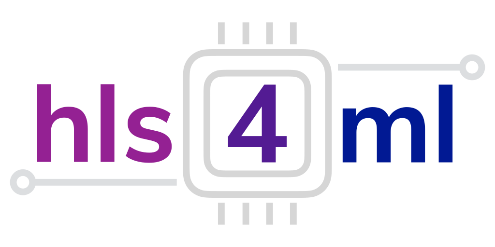

.. toctree::
    :hidden:
    :caption: Introduction

    intro/introduction
    intro/status
    intro/setup
    intro/faq
    intro/release_notes
    intro/reference

.. toctree::
    :hidden:
    :glob:
    :caption: User Guide

    api/concepts
    api/configuration
    api/command

.. toctree::
    :hidden:
    :glob:
    :caption: Frontends

    frontend/keras
    frontend/pytorch
    frontend/qonnx

.. toctree::
    :hidden:
    :glob:
    :caption: Backends

    backend/vitis
    backend/accelerator
    backend/oneapi
    backend/catapult
    backend/quartus
    backend/sr

.. toctree::
    :hidden:
    :caption: Advanced Features

    advanced/profiling
    advanced/auto
    advanced/hgq
    advanced/fifo_depth
    advanced/extension
    advanced/model_optimization
    advanced/bramfactor

.. toctree::
    :hidden:
    :glob:
    :caption: Internals

    ir/ir
    ir/modelgraph
    ir/flows
    ir/attributes

.. toctree::
    :hidden:
    :glob:
    :caption: Autogenerated API Reference

    autodoc/hls4ml.backends
    autodoc/hls4ml.converters
    autodoc/hls4ml.model
    autodoc/hls4ml.optimization
    autodoc/hls4ml.report
    autodoc/hls4ml.utils
    autodoc/hls4ml.writer

==================================
Welcome to hls4ml's documentation!
==================================

``hls4ml`` is a Python package for machine learning inference in FPGAs. We create firmware implementations of machine learning algorithms using high level synthesis language (HLS). We translate traditional open-source machine learning package models into HLS that can be configured for your use-case!

The project is currently in development, so please let us know if you are interested, your experiences with the package, and if you would like new features to be added. You can reach us through our GitHub page.

Project Status
=================================
For the latest status including current and planned features, see the :ref:`Status and Features` page.

Tutorials
=================================
Detailed tutorials on how to use ``hls4ml``'s various functionalities can be found `here <https://github.com/fastmachinelearning/hls4ml-tutorial>`_.
