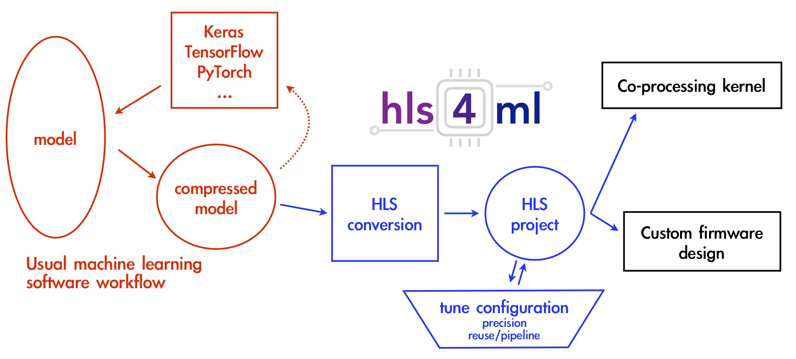

============
Introduction
============

The goal of ``hls4ml`` is to provide an efficient and fast translation of machine learning models from open-source packages (like Keras and PyTorch) for training machine learning algorithms to high level synthesis (HLS) code that can then be transpiled to run on an FPGA. The resulting HLS project can be then used to produce an IP which can be plugged into more complex designs or be used to create a kernel for CPU co-processing. The user has freedom to define many of the parameters of their algorithm to best suit their needs.

The ``hls4ml`` package enables fast prototyping of a machine learning algorithm implementation in FPGAs,
greatly reducing the time to results and giving the user intuition for how to best design a machine learning algorithm for their application while balancing performance, resource utilization and latency requirements.

The Inspiration
===============

The inspiration for the creation of the ``hls4ml`` package stems from the high energy physics community at the CERN Large Hadron Collider (LHC).
While machine learning has already been proven to be extremely useful in analysis of data from detectors at the LHC, it is typically performed in an "offline" environment after the data is taken and agglomerated.
However, one of the largest problems at detectors on the LHC is that collisions, or "events", generate too much data for everything to be saved.
As such, filters called "triggers" are used to determine whether a given event should be kept.
Using FPGAs allows for significantly lower latency so machine learning algorithms can essentially be run "live" at the detector level for event selection. As a result, more events with potential signs of new physics can be preserved for analysis.

The Solution: ``hls4ml``
========================

With this in mind, let's take a look at how ``hls4ml`` helps to achieve such a goal. First, it's important to realize the architecture differences between an FPGA and a CPU or GPU.
An FPGA can be specifically programmed to do a certain task, in this case evaluate neural networks given a set of inputs, and as such can be highly optimized for the task, with tricks like pipelining and parallel evaluation. However, this means dynamic remapping while running isn't really a possibility.
FPGAs also often come at a comparatively low power cost with respect to CPUs and GPUs. This allows ``hls4ml`` to build HLS code from compressed neural networks that results in predictions on the microsecond scale for latency.
The ``hls4ml`` tool saves the time investment needed to convert a neural network to a hardware design language or even HLS code, thus allowing for rapid prototyping.

For more detailed information on technical details of ``hls4ml``, read the "Internals" section of our documentation or our :doc:`References <reference>` page. All figures on this page are taken from the following paper: `JINST 13 P07027 (2018) <https://dx.doi.org/10.1088/1748-0221/13/07/P07027>`_.
